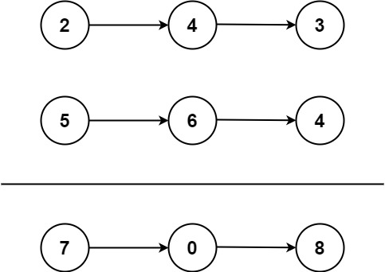

# 0002.两数相加[中等]

给你两个 非空 的链表，表示两个非负的整数。它们每位数字都是按照 逆序 的方式存储的，并且每个节点只能存储 一位 数字。

请你将两个数相加，并以相同形式返回一个表示和的链表。

你可以假设除了数字 0 之外，这两个数都不会以 0 开头。

 

示例 1：

```
输入：l1 = [2,4,3], l2 = [5,6,4]
输出：[7,0,8]
解释：342 + 465 = 807.
```

示例 2：
```
输入：l1 = [0], l2 = [0]
输出：[0]
```

示例 3：
```
输入：l1 = [9,9,9,9,9,9,9], l2 = [9,9,9,9]
输出：[8,9,9,9,0,0,0,1]
```

> 提示：<br/>
>每个链表中的节点数在范围 [1, 100] 内<br/>
>0 <= Node.val <= 9<br/>
>题目数据保证列表表示的数字不含前导零

>来源：力扣（LeetCode）<br/>
>链接：https://leetcode-cn.com/problems/add-two-numbers <br/>
>著作权归领扣网络所有。商业转载请联系官方授权，非商业转载请注明出处。

```java
public class LeetCodes0002 {
    public static void main(String[] args) {
        ListNode l1 = initListNoede(new int[]{2,5,6});
        System.out.println(listNodeToString(l1));
        ListNode l2 = initListNoede(new int[]{6,5,2});
        System.out.println(listNodeToString(l2));
        ListNode l = addTwoNumbers(l1,l2);
        System.out.println(listNodeToString(l));
    }

    static public ListNode addTwoNumbers(ListNode l1, ListNode l2) {
        ListNode n1 = l1;
        ListNode n2 = l2;
        ListNode l = new ListNode();
        ListNode node = l;
        while (n1!=null || n2!=null){
            int num = ((n1!=null)?n1.val:0) + ((n2!=null)?n2.val:0);
            if (node.val+num>=10){
                node.val = node.val + num - 10;
                node.next = new ListNode(1);
            }else {
                node.val += num;
                if ((n1!=null&&n1.next!=null) || (n2!=null&&n2.next!=null))
                node.next = new ListNode(0);
            }
            node = node.next;
            n1 = n1==null?null:n1.next;
            n2 = n2==null?null:n2.next;
        }
        return l;
    }

    /**
     * 官方答案
     * @param l1
     * @param l2
     * @return
     */
    static public ListNode addTwoNumbers2(ListNode l1, ListNode l2) {
        ListNode head = null, tail = null;
        int carry = 0;
        while (l1 != null || l2 != null) {
            int n1 = l1 != null ? l1.val : 0;
            int n2 = l2 != null ? l2.val : 0;
            int sum = n1 + n2 + carry;
            if (head == null) {
                head = tail = new ListNode(sum % 10);
            } else {
                tail.next = new ListNode(sum % 10);
                tail = tail.next;
            }
            carry = sum / 10;
            if (l1 != null) {
                l1 = l1.next;
            }
            if (l2 != null) {
                l2 = l2.next;
            }
        }
        if (carry > 0) {
            tail.next = new ListNode(carry);
        }
        return head;
    }


    /**
     * 这个类是提供好的现成的
     */
    static class ListNode {
        int val;
        ListNode next;
        ListNode() {}
        ListNode(int val) { this.val = val; }
        ListNode(int val, ListNode next) { this.val = val; this.next = next; }
    }
    /**
     * 这个方法是自己写的，配合测试
     */
    static ListNode initListNoede(int[] a){
        ListNode l = new ListNode();
        ListNode ll = l;
        for (int i = 0; i < a.length; i++){
            ll.val = a[i];
            if (i != a.length-1){
                ll.next = new ListNode();
                ll = ll.next;
            }
        }
        return  l;
    }

    static String listNodeToString(ListNode node) {
        StringBuilder sb = new StringBuilder("[");
        while (node != null) {
            sb.append("" + node.val+",");
            node = node.next;
        }
        sb.delete(sb.length()-1,sb.length());
        sb.append("]");
        return new String(sb);
    }
}
```